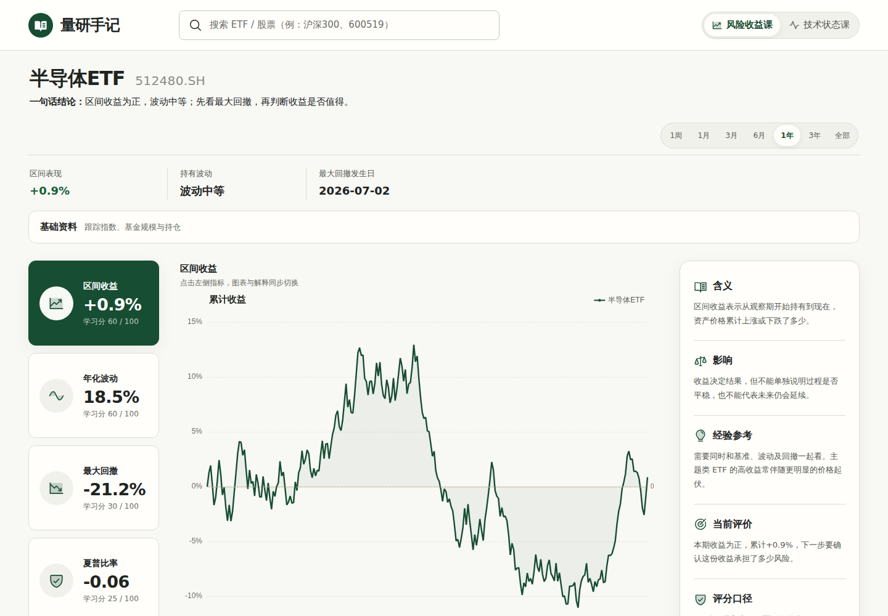
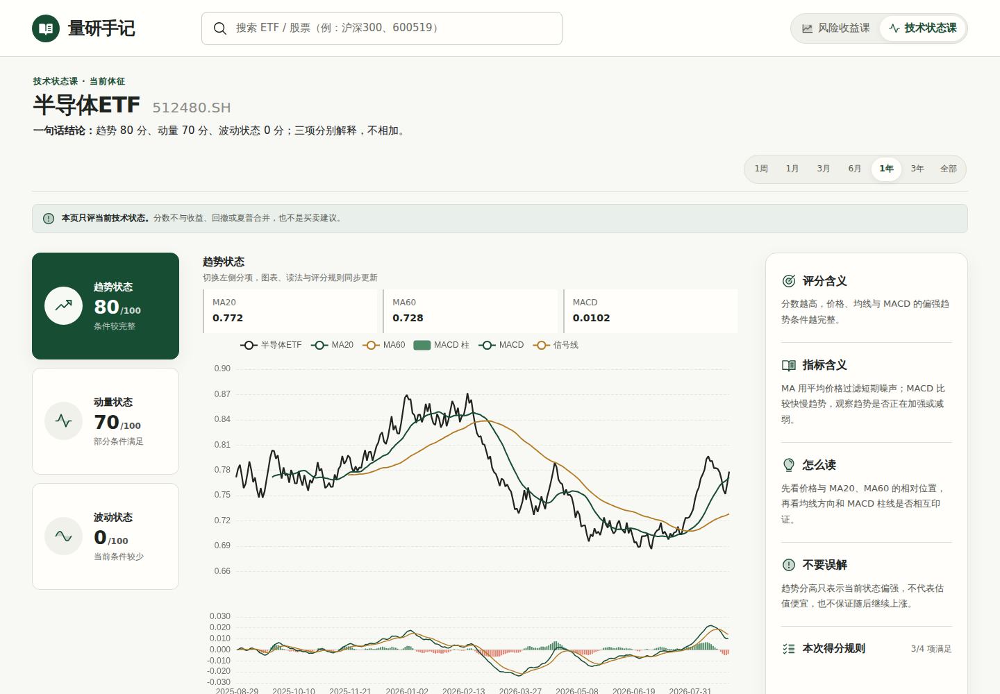
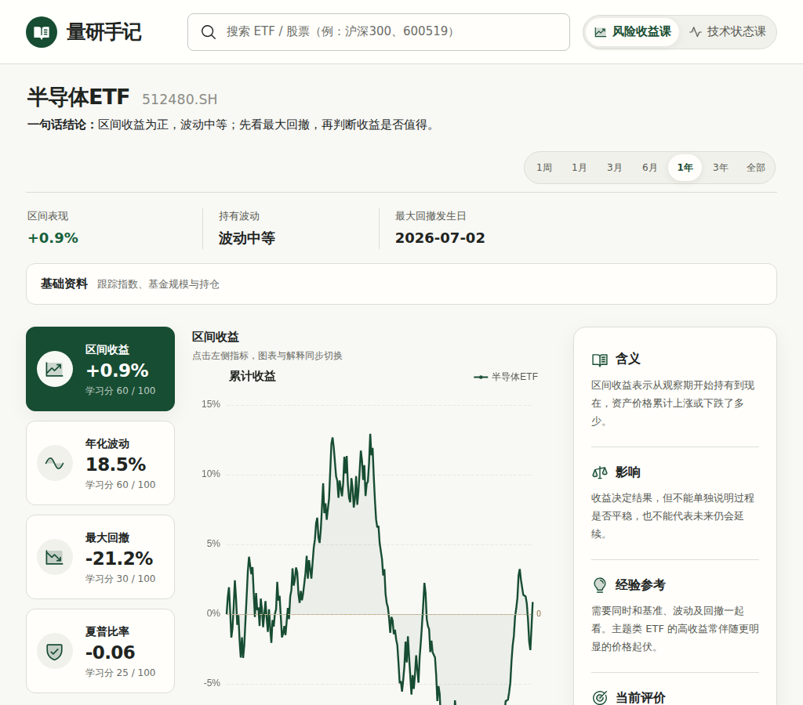

# 桌面页面布局复评

日期：2026-08-29  
范围：风险收益课、技术状态课，以及声明的最小桌面宽度 1024px。  
目标：判断当前信息层级、三栏比例、垂直节奏和桌面下限是否协调。

## 总体判断

1440px 下整体风格统一、三栏关系清楚，图表仍是视觉中心。当前最明显的结构问题是：删除区间说明后，日期按钮单独占据一条 61px 高的全宽工具栏，形成空带；风险页主工作区因此到页面顶部 423px 后才开始。1024px 下没有横向溢出，但 190 / 约 472 / 260px 的三栏会明显压缩金融图表和右侧文字，不够从容。

## 审查步骤

### 1. 风险收益课，1440 × 1000 — 需要收紧

优点：标题、摘要、指标卡、图表和解释区的阅读顺序明确；212 / 784 / 292px 三栏比例合理，颜色与圆角也一致。

问题：主工作区从 y=423px 才开始，首屏看不到完整横轴；区间按钮所在工具栏高 61px，但左侧已经没有内容，视觉上像一条未完成的空带。基础资料折叠区本身高度合理，不是主要问题。

建议：把区间按钮并入标题摘要行或三项快速事实行，并删除独立工具栏。仅此一项即可把主图整体上移约 61px。

### 2. 技术状态课，1440 × 1000 — 基本健康

优点：趋势卡、指标值、图例和主图的对应关系清楚；主工作区比风险页更早出现，图表密度适中。

问题：顶部仍有“技术状态课 · 当前体征”眉题，而风险页已没有对应眉题，两个课页标题基线不一致。绿色说明条也只存在于技术页，进一步造成页面切换时内容上下跳动。右侧解释卡固定最小高度 760px，折叠评分规则时底部留下较多空白。

建议：统一两个课页的标题结构；优先删除技术页重复眉题，并把投资建议说明统一放到公共位置。右侧卡片改为内容自适应高度，必要时使用桌面端 sticky，而不是固定最小高度。

### 3. 最小桌面宽度，1024 × 900 — 可用但偏拥挤

优点：实测页面宽度与视口同为 1024px，没有横向溢出；页头和切换控件没有重叠。

问题：中央图表只剩约 450–472px，右侧 260px 文本频繁换行。三栏虽然能放下，但图表已不再有足够视觉权重，这与量化研究页的核心任务不匹配。

建议二选一：

1. 若坚持支持 1024px 桌面视口，在 1180px 以下改为“指标栏 + 图表”两栏，解释区移到图表下方；这仍是桌面紧凑布局，不是移动端设计。
2. 若产品只面向较宽桌面，把正式最小宽度提高到 1180px，并同步文档，不再承诺 1024px。

## 优先级

1. **高：** 合并日期区间控件与上方摘要，移除空工具栏。
2. **高：** 明确 1024px 支持策略；推荐两栏紧凑桌面布局，或将最小宽度提高到 1180px。
3. **中：** 统一两个课页的标题和说明结构，减少切换时的垂直跳动。
4. **中：** 移除技术解释卡固定最小高度，减少折叠状态下的空白。

## 可访问性与证据限制

截图确认 1024px 下没有可见重叠或横向滚动。1440px 下正文和图表标注可读；1024px 下图表标注与右栏长文较密，长时间阅读负担增加。本轮仅凭截图和布局尺寸，不能确认键盘焦点顺序、屏幕阅读器提示、缩放到 200% 后的重排或动态图表状态播报。
