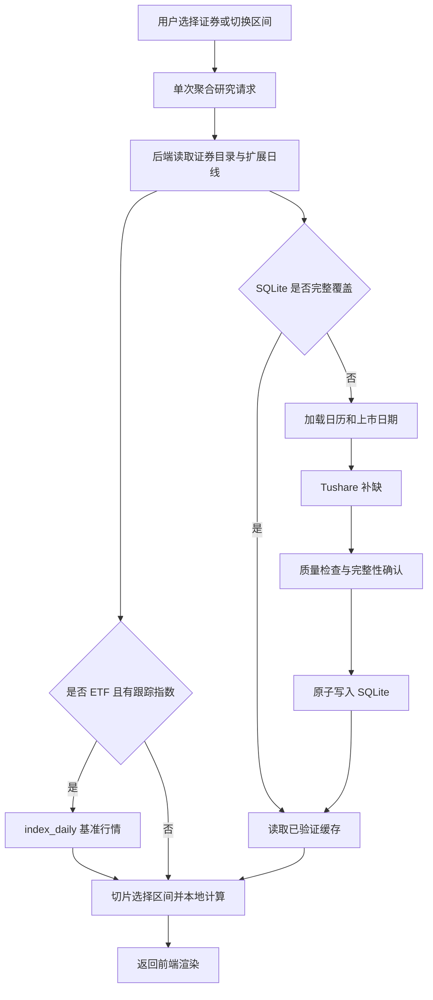

# 股票与 ETF 数据策略及业务流

> 状态：当前实现说明  
> 核对日期：2026-08-31  
> 适用范围：A 股、场内 ETF、证券目录、资产资料、风险收益与技术指标分析

本文描述当前代码实际执行的数据获取、保存、读取和页面业务流。`docs/superpowers` 下的设计稿与实施计划属于历史基线，其中关于 AkShare 主源或多数据源降级的内容不代表当前实现。

## 1. 结论

当前系统采用：

> 单一 Tushare Pro 外部数据源 + SQLite 持久化缓存 + 交易日历逐日完整性判断 + 缺口补齐 + 本地指标计算。

系统面向本地日线研究，不是实时行情系统，也没有后台定时采集任务。数据获取由页面请求或手动刷新接口触发。

当前关键口径：

| 项目 | 当前实现 |
| --- | --- |
| 外部数据源 | 仅 Tushare Pro |
| 行情频率 | 日线 |
| 价格口径 | 后复权（HFQ） |
| 持久化 | SQLite |
| 获取方式 | 缓存优先、请求驱动、缺口补齐、最新交易日按终态刷新 |
| 完整性依据 | 价格行 + 交易日历 + 无行情日期事实 |
| 实时行情 | 不支持 |
| 定时同步 | 不支持 |
| AkShare | 已停用，旧数据已从项目数据库删除 |

## 2. 数据获取策略

### 2.1 Token 与 Provider 初始化

后端优先从 `TUSHARE_TOKEN_FILE` 读取 Token，其次读取 `TUSHARE_TOKEN`。如果没有 Token，仍会创建名称固定为 `Tushare Pro` 的 Provider，以便完整的 SQLite 缓存可以继续离线使用；真正出现缓存缺口时才会报数据源配置错误。

数据库和 Provider 在进程内复用。`MarketDataService` 每次依赖注入时重新创建轻量服务对象，但共享同一个缓存实例和 Provider 实例。

### 2.2 证券代码

内部代码统一为 `六位数字.交易所`，例如 `600519.SH`、`000001.SZ`。裸代码按首位数字推断 `.SH`、`.SZ` 或 `.BJ`。

证券入口只接受 `.SH`、`.SZ`、`.BJ`。ETF 跟踪基准走独立指数入口，接受带显式市场后缀的 `.SH`、`.SZ`、`.CSI`、`.CNI`、`.SW` 指数代码，例如 `H30184.CSI`；指数不会混入证券目录或普通证券代码推断。

### 2.3 行情接口与标准化

| 对象 | Tushare 接口 | 标准化 |
| --- | --- | --- |
| A 股 | `daily` + `adj_factor` | OHLC 乘复权因子 |
| 场内 ETF | `fund_daily` + `fund_adj` | OHLC 乘复权因子 |
| ETF 跟踪指数 | `index_daily` | 不复权的指数 OHLC，用于同期基准比较 |
| 交易日历 | `trade_cal` | 转为逐日 `is_open` 状态 |
| 股票停牌 | `suspend_d` | 仅补充历史缺失原因 |

行情读取后执行以下转换：

- 日期转为标准日期并按升序排列；
- OHLC 乘 `adj_factor`，形成后复权序列；
- Tushare `amount` 从千元乘以 1,000 转为元；
- `volume` 保留 Tushare 返回口径；
- 为每行记录 `source` 和 UTC `fetched_at`。

### 2.4 目录和资产资料

证券目录由以下接口合并：

- 股票：`stock_basic`，只加载上市状态 `L`；
- ETF：`etf_basic`。

股票资料调用：

- `daily_basic`：最近估值、换手率、市值；
- `income`：营业收入和净利润；
- `fina_indicator`：ROE、同比增速、利润率、资产负债率。

ETF 资料调用：

- `fund_basic`：管理人、成立日期、基准；
- `fund_nav`：最新净值和规模；
- `fund_portfolio`：最新报告期前十大持仓。

研究主流程只需要 ETF 的 `index_code` 时，直接读取已加载的 `etf_basic` 目录元数据，不会为此调用 `fund_basic`、`fund_nav` 或 `fund_portfolio`。完整资产资料接口仍保留为独立能力。

### 2.5 缺口补齐算法

一次日线请求按以下步骤执行：

1. 标准化证券代码并校验日期范围。
2. 将未来的结束日期裁剪到今天，并添加 `FUTURE_RANGE_TRUNCATED` 告警。
3. 以上海市场时区判断日线终态：18:00 前不把今天纳入日线分析，并添加 `CURRENT_SESSION_EXCLUDED`。
4. 从 SQLite 同时读取行情、交易日历和无行情日期。
5. 逐个自然日检查是否已经得到解释。
6. 如果全部日期已解释且行情质量合格，直接返回缓存；但今天的行情如果抓取于 18:00 前，会自动重新请求今天以确认盘后终态。
7. 对未解决日期涉及的年份加载完整交易日历。
8. 排除休市日，并通过证券目录识别上市日期。
9. 把上市前历史日期记录为 `not_listed`。
10. 将剩余目标日期按最长 366 个自然日分段请求日线。
11. 对证券历史交易日仍缺失的数据再执行一次单日查询；股票缺失日可通过 `suspend_d` 标记为 `suspended`，其他确认空结果标记为 `provider_confirmed_empty`。
12. 指数不做停牌和逐日探测；分段 `index_daily` 返回中的历史缺失直接记录为已确认空数据，避免指数成立前产生大量单日请求。
13. 只有所有历史目标日期均得到价格或明确无行情原因后，才允许提交缓存。

18:00 后如果 Tushare 仍未发布今天的日线，系统会提交并返回截至最近已完成交易日的完整历史，保留今天为可重试缺口，并添加 `LATEST_BAR_PENDING`，不会再把整段请求判为不可用。

需要注意：“只补缺口”是逻辑目标，但当前分段器会把 366 天以内的稀疏缺口合并为一个起止区间，因此可能从 Tushare 重复下载区间内部已经缓存的数据。

### 2.6 为什么当前指标在本地计算

本地计算是当前架构选择，不是因为 Tushare 完全没有这些指标，也不是硬性要求。

Tushare 当前提供 `stk_factor`、`stk_factor_pro`、`fund_factor_pro`、`idx_factor_pro` 和单独的量化因子库。股票专业因子包含后复权 MA、MACD、布林带和 ATR 等字段；场内基金专业因子也包含这些技术指标，但公开字段主要基于不复权价格。接口通常需要较高积分或单独权限，而且参数和本项目并不完全一致。

| 本项目指标 | Tushare 可用性 | 当前仍本地计算的原因 |
| --- | --- | --- |
| 区间收益 | 可由日涨跌幅或部分固定窗口收益因子间接获得 | 用户可选择任意起止日期，需要和当前后复权价格首尾严格一致 |
| 年化波动 | 因子库有固定窗口波动率 | 本项目同时计算选择区间和 20 日滚动波动，使用样本标准差、252 日年化口径 |
| 最大/当前回撤 | 没有与任意用户区间完全等价的通用直接结果 | 回撤依赖用户选择的起点、峰值路径和回撤持续期定义 |
| 夏普比率 | 因子库有部分固定窗口 Sharpe 因子 | 本项目使用选择区间、2% 年化无风险利率和自己的年化收益/波动公式 |
| MA20/MA60 | 股票、基金专业技术因子可提供固定周期 MA | 本地计算可确保股票与 ETF 都使用同一份后复权收盘价和完全相同的预热历史 |
| MACD | 股票、基金专业技术因子可提供 | 本项目柱线定义为 `DIF - DEA`，不额外乘 2；上游字段定义可能不同 |
| RSI 14 | 普通/专业技术因子主要提供 RSI 6/12/24；单独因子库存在 RSI 14 | 当前页面明确使用 Wilder RSI 14，且 ETF 和普通 Token 的可用性不能统一保证 |
| 布林带 | 专业技术因子提供 N=20、P=2 | 股票可取后复权字段，但场内基金专业因子公开字段主要是不复权，和当前价格序列不一致 |
| ATR 14 / 价格 | 专业技术因子提供 ATR 20 | 本项目使用 Wilder ATR 14，并除以价格得到跨标的可比较的百分比 |

本地计算的实际收益是：

- 所有指标与缓存中的后复权 OHLC 使用同一个事实来源；
- A 股和 ETF 使用相同公式，不受不同专业接口字段差异影响；
- 用户切换任意区间时可以立即重算；
- 完整缓存下不需要额外因子接口权限或网络调用；
- 教学文案、公式、诊断规则和测试可以逐项对应；
- 避免行情来自一套复权口径、指标来自另一套口径。

推荐继续把本地计算作为页面权威值。如果账户具有专业因子权限，可选接入 Tushare 因子作为离线抽样校验或数据质量对账来源，不建议在没有统一复权、周期、平滑和区间定义前直接替换页面指标。

### 2.7 数据质量门禁

Provider 数据在写入前会检查：

- 证券代码与请求一致；
- 日期位于请求范围内；
- 日期不重复且序列有序；
- OHLC 为正数、有限值并满足价格关系；
- 成交量、成交额为有限非负值；
- 单日收益绝对值不超过 50%；
- 合并后的代码和来源一致。

任一致命检查失败，本次获取不会写入部分行情、日历或无行情事实。

同一数据库、Provider 和证券代码的并发获取通过固定分片锁合并，避免页面并行请求同时重复访问 Tushare。

## 3. 数据保存策略

### 3.1 SQLite 表

| 表 | 保存内容 | 主键/隔离方式 |
| --- | --- | --- |
| `price_bars` | 证券后复权 OHLC 或指数原始 OHLC、成交量、成交额、来源、抓取时间 | `dataset + code + trade_date` |
| `market_calendar` | 交易所逐日开闭市状态 | `exchange + cal_date` |
| `no_bar_dates` | 上市前、停牌或确认无行情 | `dataset + code + trade_date` |
| `instrument_catalog` | 股票与 ETF 完整目录及元数据 | `provider + code` |
| `asset_profiles` | 标准化股票/ETF 资料 JSON | `provider + code` |
| `provider_state` | 成功、失败、连续失败次数和冷却时间 | `code + data_kind + adjustment + provider` |
| `cache_metadata` | 缓存策略版本 | `key` |
| `sync_ranges` | 旧版兼容数据 | 不再作为 Tushare 完整性依据 |

### 3.2 写入规则

- 行情、交易日历和无行情日期通过同一个 SQLite 事务提交。
- 行情按主键 UPSERT；新结果覆盖同一来源、证券和交易日的旧值。
- 写入价格时会删除同日旧的 `no_bar_dates`；写入无行情事实时会删除同日旧价格。
- Provider 返回结果没有完整验证前，不提交任何阶段性事实。
- 证券目录以 Provider 为单位完整替换，确保一个快照具有相同抓取时间。
- 只有 `availability=available` 的资产资料才持久化；暂时不可用的资料只可能进入进程内缓存。
- 数据库按 `dataset/provider` 隔离。证券日线使用 `Tushare Pro`，指数日线使用独立的 `Tushare Pro:index_daily` 命名空间。

### 3.3 TTL 与刷新

| 数据 | TTL/刷新策略 |
| --- | --- |
| 行情 | 历史日永久复用；最新交易日按上海时间 18:00 终态边界自动复核 |
| 证券目录 | 24 小时 |
| 资产资料 | 10 分钟 |
| 目录刷新失败后的重试间隔 | 60 秒 |
| 资料刷新失败后的重试间隔 | 60 秒 |
| 手动行情刷新 | 页面“刷新行情”强制刷新最近 60 个自然日 |

系统没有后台定时刷新任务。刷新仍是请求驱动：普通页面读取会执行最新交易日终态检查，用户也可以通过页脚的“刷新行情”主动刷新。

`POST /api/data/{code}/refresh` 只有在最近 60 个自然日的数据完成验证并提交 SQLite 后才返回 `data.refreshed=true`、`data.status=refreshed`。如果上游失败但存在完整旧缓存，接口返回 `refreshed=false`、`status=stale_cache`，并在原样返回的 `meta.warnings` 中保留 `STALE_CACHE`；没有完整缓存时返回 `DATA_UNAVAILABLE`，不会伪装成刷新成功。

## 4. 数据读取策略

### 4.1 完整缓存判定

当前系统不再使用首尾日期或 `sync_ranges` 推断覆盖范围。对请求范围内的每个自然日，只要符合以下任一条件，就认为该日已解释：

```text
存在合法价格行
或 交易日历确认当天休市
或 历史日期存在 not_listed / suspended / provider_confirmed_empty
```

整个范围全部得到解释并通过质量检查时，才是完整缓存命中。

### 4.2 行情读取

- 查询严格限定数据集、代码和日期范围；证券与指数缓存不会串读；
- 按交易日期升序返回；
- SQLite 行会重新经过 Pydantic 模型校验；
- 损坏或旧格式行不会跨过模型边界，而是被忽略并成为普通缓存缺口；
- 完整缓存可以在未配置 Token 的情况下离线读取。

### 4.3 失败与降级

行情数据源失败后：

- 如果请求范围原本已经完整验证，可在强制刷新失败时返回旧缓存并标记 `STALE_CACHE`；
- 如果只有部分缓存，不返回不完整结果，而是报 `DATA_UNAVAILABLE`；
- 历史完整缓存直接返回；结束日为今天时，会检查当天价格的抓取时间，18:00 前的价格行会在盘后自动复核；
- 今天尚未发布时返回截至最近已完成交易日的数据，并标记 `LATEST_BAR_PENDING`；
- Provider 连续失败后按 5、30、120 分钟进入冷却，完整缓存仍可在冷却期间读取。

证券目录和资产资料采用不同的降级策略：TTL 到期后尝试刷新，上游失败则返回最近成功快照并标记 `STALE_CACHE`。资产资料调用有 6 秒等待上限和 60 秒慢源冷却；行情调用目前没有显式超时或有限重试。

### 4.4 响应元信息

业务响应通常返回：

```json
{
  "data": "...",
  "meta": {
    "sources": ["Tushare Pro"],
    "fetched_at": "UTC 时间",
    "cache_hit": true,
    "data_end_date": "实际最后交易日",
    "warnings": []
  }
}
```

目录和资产资料的 `fetched_at` 表示真实快照时间；行情响应的 `fetched_at` 取实际最后交易日价格行的抓取时间，不再使用本次 HTTP 响应时间。`data_end_date` 明确表示实际最后交易日；若范围内没有任何价格行，该字段为 `null`，`fetched_at` 才使用响应生成时间。

## 5. 页面数据业务流

### 5.1 主流程



### 5.2 前端请求

默认证券是 `512480.SH`，默认区间是一年。每次证券或区间变化，前端只请求一次 `/api/research/{code}?start=&end=`。该响应聚合证券、选择区间日线和分析结果；页面不再获取未使用的 `profile`。

证券或区间变化、连续手动刷新以及组件卸载时，前端会中止上一轮研究/刷新请求，并通过共享的递增请求编号阻止旧结果覆盖新结果。刷新接口和刷新后的聚合研究请求共用同一个 `AbortSignal`。开发模式下 React Strict Mode 会执行一次额外的挂载清理周期，前端可能中止第一批请求；后端已开始执行的同步请求不一定随浏览器中止而取消。

### 5.3 分析请求

聚合研究接口和兼容的 `/api/analysis/{code}` 共用同一条内部流程：

1. 从开始日期向前扩展 120 个自然日，只读取一次日线；
2. 在内存中切出用户选择区间，同时保留扩展历史预热 MA60 等滚动指标；
3. ETF 从目录轻量读取跟踪指数代码，并通过 `index_daily` 取同期基准；
4. 本地计算区间收益、年化波动、最大回撤、夏普比率、MA、MACD、RSI、布林带、ATR 和诊断分数。

基准获取失败时仍返回标的自身分析，但会在 `meta.warnings` 中添加 `BENCHMARK_UNAVAILABLE`，不再静默吞掉异常。

## 6. 五项 Review 意见的修复状态

### 已修复：ETF 基准指数链路不可用且静默失败

已增加独立指数代码规范化、`TushareProvider.get_index_daily`、指数缓存命名空间和 ETF 基准分析链路；失败时返回 `BENCHMARK_UNAVAILABLE`。

### 已修复：交易日盘中可能无法读取“截至昨日”的结果

已按上海市场时区设置 18:00 日线终态边界；盘中排除今天，盘后尚未发布则返回截至最近已完成交易日的数据，并分别返回明确告警。

### 已修复：行情没有自动新鲜度策略

今天的价格若抓取于终态边界前，18:00 后首次读取会自动复核；页面页脚已挂载“刷新行情”入口。

### 已修复：页面存在重复和未使用请求

已增加 `/api/research/{code}`，前端从四个并行请求收敛为一个；分析内部只读取一次 120 天扩展区间并在内存切片；ETF 基准只读目录元数据，不再加载完整资料。

### 已修复：行情更新时间展示可能误导

行情 `meta.fetched_at` 已改为最后交易日价格行的真实抓取时间，并新增 `data_end_date`；页脚同时展示“数据截至”和“行情抓取于”。当日回退状态通过告警和可见提示表达。

## 7. 仍保留的边界与改进优先级

### P2：长区间和稀疏缺口请求成本偏高

- “全部”区间从 1990 年开始，当前实现可能在得知上市日期前先按年补大量交易日历；
- 稀疏缺口在 366 天以内可能被合并成较宽的 Tushare 请求；
- 历史交易日缺失会触发逐日确认，极端情况下形成较多请求；
- 资产资料接口没有显式日期范围或行数限制。

建议：先从目录获取上市日期，再确定日历范围；按连续缺口分段；为资料查询增加明确时间窗和返回上限。

### P2：本地并发写入能力有限

当前 SQLite 使用默认 DELETE journal 模式，每次操作新建连接。适合本地单用户研究，但在并行写入或多进程部署时可能出现锁竞争。

建议：如果未来进入多用户或多 worker 部署，再评估 WAL、统一连接策略或独立数据库服务。

## 8. 总体评价

当前方案对历史日线的完整性处理较严谨：它不会仅凭首尾价格推断完整，也不会在验证失败后提交半份缓存，且完整缓存支持无 Token 离线读取。

现阶段更适合作为本地、单用户、日线研究工具。上述五项优先问题已处理；下一轮数据层重点是长区间分段效率、外部调用超时/重试，以及多用户场景下的 SQLite 并发能力。

## 9. 代码索引

- 配置与数据库路径：`backend/src/quantlab/config.py`
- Provider 和 Token 初始化：`backend/src/quantlab/api/dependencies.py`
- Tushare 接口映射与标准化：`backend/src/quantlab/providers/tushare_provider.py`
- 行情完整性、补缺和降级：`backend/src/quantlab/services/market_data.py`
- SQLite 表和事务：`backend/src/quantlab/cache.py`
- 证券目录与资产资料缓存：`backend/src/quantlab/services/assets.py`
- 行情与分析 API：`backend/src/quantlab/api/market.py`
- 前端请求编排：`frontend/src/api/client.ts`
- 页面加载状态与请求取消：`frontend/src/hooks/useResearch.ts`

Tushare 官方接口参考：

- [股票技术因子](https://tushare.pro/document/2?doc_id=296)
- [股票技术面因子（专业版）](https://tushare.pro/document/2?doc_id=328)
- [场内基金技术因子（专业版）](https://tushare.pro/document/2?doc_id=359)
- [指数技术因子（专业版）](https://tushare.pro/document/2?doc_id=358)
- [量化因子库介绍](https://tushare.pro/document/2?doc_id=485)
- [量化因子值](https://tushare.pro/document/2?doc_id=490)
